# YOLOv4_traffic_sign_detection
This is a repository for the  traffic sign detection using the YOLOv4.

## Content

1. Traffic sign data set making

In this repo, the [TT100K](https://cg.cs.tsinghua.edu.cn/traffic-sign/) dataset has been used to  train and test the model. In order to use the TT100K, it firstly needs to transfer to PASCAL VOC format. 

2. Automatically classify the training dataset and test dataset
3. YOLOv4 configuration file setting
4. training and testing YOLOv4 network
5. evaluating the network 


## Object Detection

The object detection has two tasks: the localisation (Bounding box) and recognition (category label).

- For the single object: the problem is classification and localisation.

- For the multiple objects: the problem is  objection detection and instance segmentation. 

Localisation and detection:

- Localisation: the definition is to find a labelled object in one image. 
- Detection: find all objects in one image. 

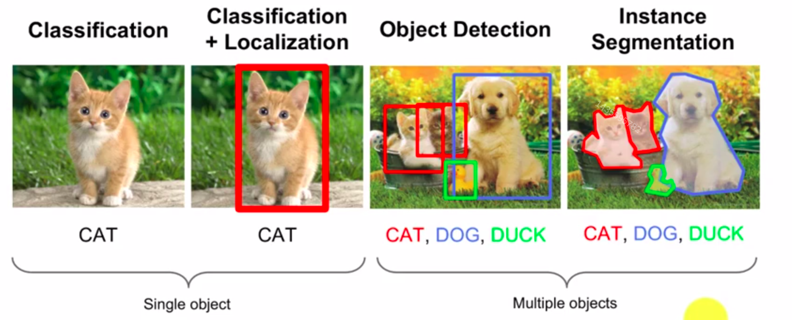


## Benchmark Dataset

- PASCAL VOC 

It includes 20 categories and it has 11530 images. 

- ImageNet (ILSVRC 2010-2017)

It contains 1000 categories and it uses to classification, localisation and detection. It has 470000 images. 

- COCO 

COCO: Microsoft Common Objects in Context. COCO has 200000 images and 80 categories in it. 

**Evaluating the network performance**

- Precision, Recall, F1 score

$recall = \frac{TP}{TP+FN}$ 

$precision = \frac{TP}{TP+FP}$

$Accuracy = \frac{TP+TN}{TP+FP+FN+TN}$

$F1 = \frac{2*precision*recall}{precision + recall}$

- IoU (Intersection over Union)

$IoU = \frac{area-of-overlap}{area-of-union}$

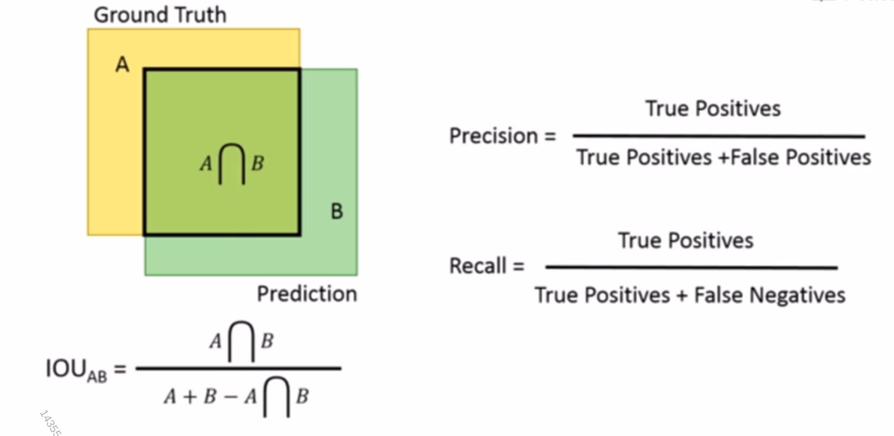

If $IoU > threshold$, $B$ is True positive, or False Positive. 

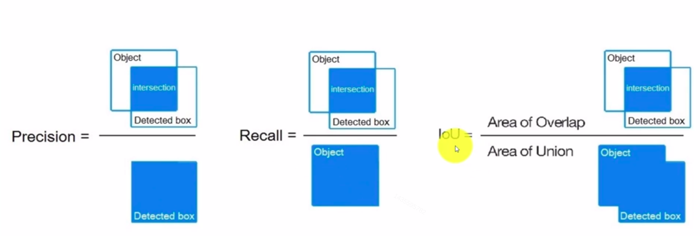


- P-R curve (Precision- Recall curve)
- AP (Average Precision)

- mAP (mean Average Precision)
- FPS (Frames Per Second)

**Summary**

1. Pascal VOC 2007 uses 11 Recall Points on PR curve.
2. Pascal VOC 2010-2021 uses Area Under Curve on PR curve.
3. MS COCO uses 101 Recall points on PR curve as well as different IoU thresholds. 


## Traffic Sign Dataset

1. GTSRB dataset 
2. BTSD dataset 
3. LISA dataset 
4. CCTSDB dataset 
5. TT100K dataset 


**Chinese road sign:**

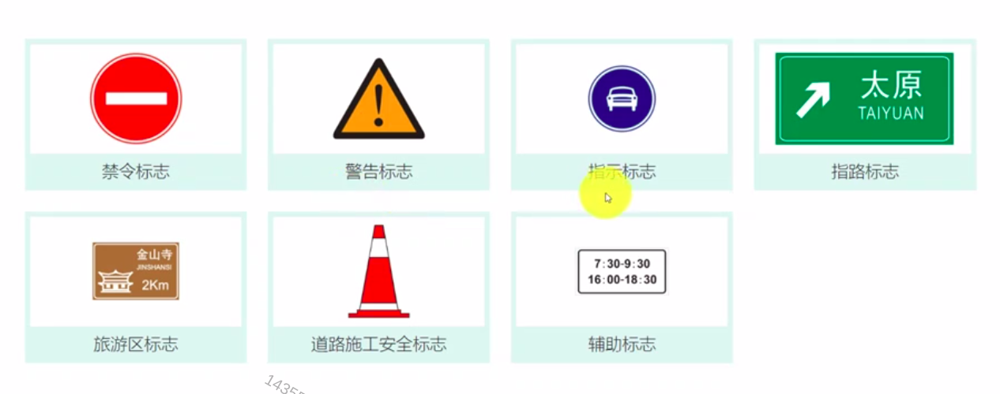


## YOLOv4 

The road map of object detection:

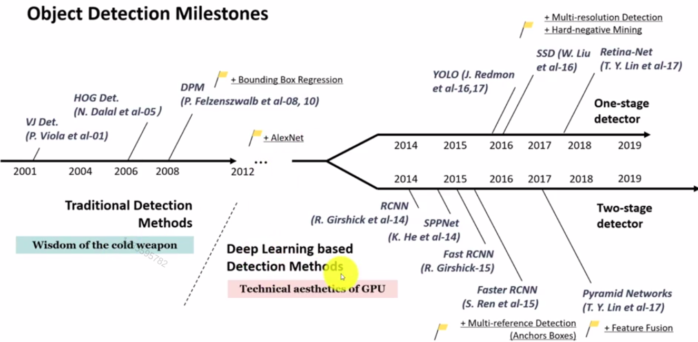


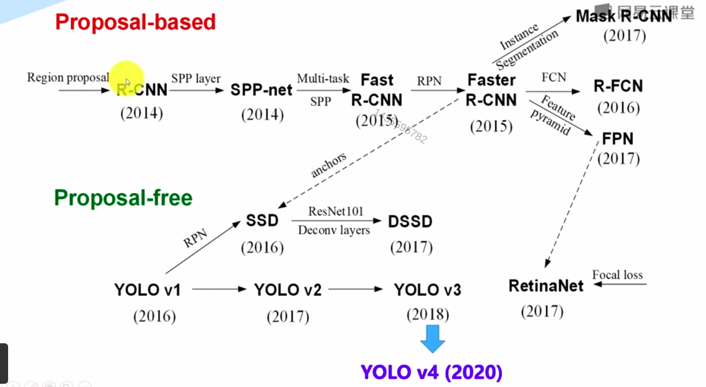


**Darknet**

Darknet is an open source neural network framework written in C and CUDA. It is fast, easy to install , and supports CPU and GPU computation. 

**YOLOv4 source code:** https://github.com/AlexeyAB/darknet 

**YOLOv4 paper:** https://arxiv.org/abs/2004.10934


**The basic idea of YOLOv3:**


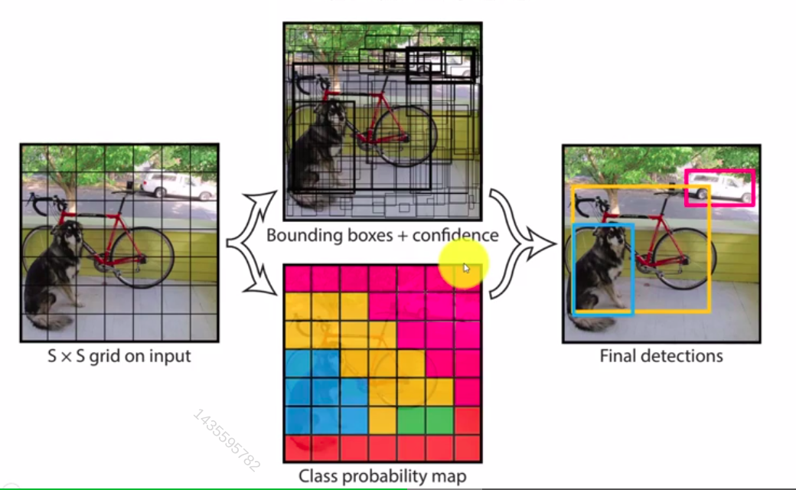


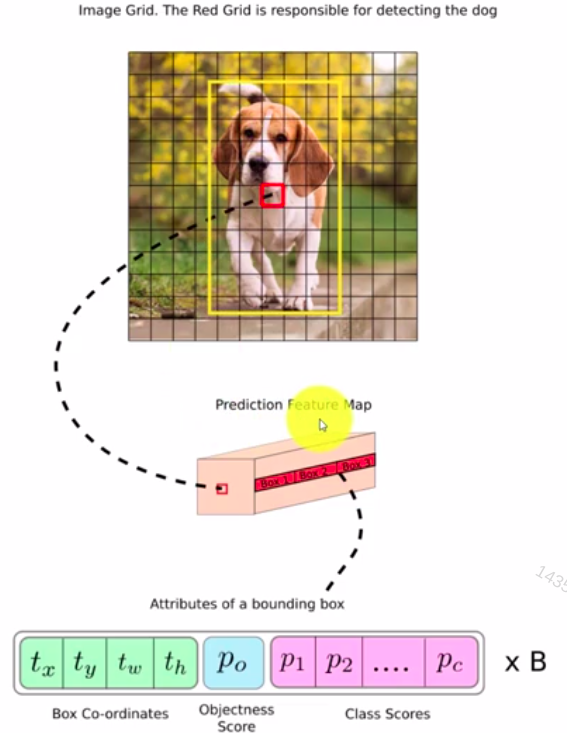

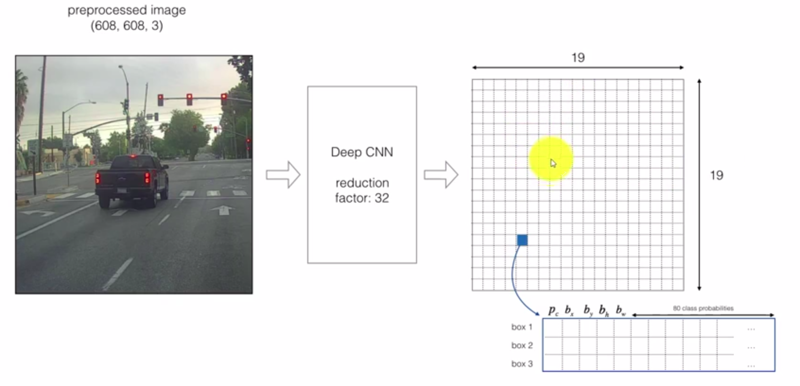

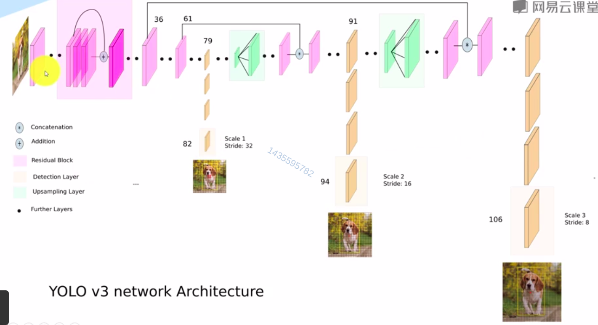


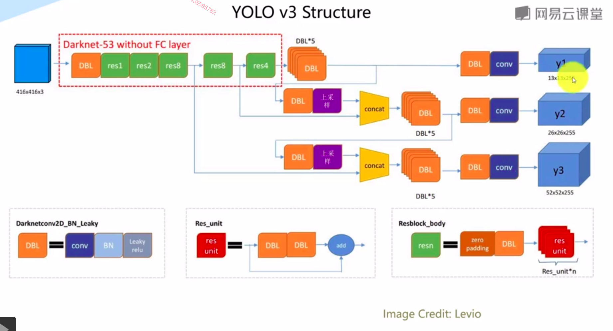


**YOLOv4:**

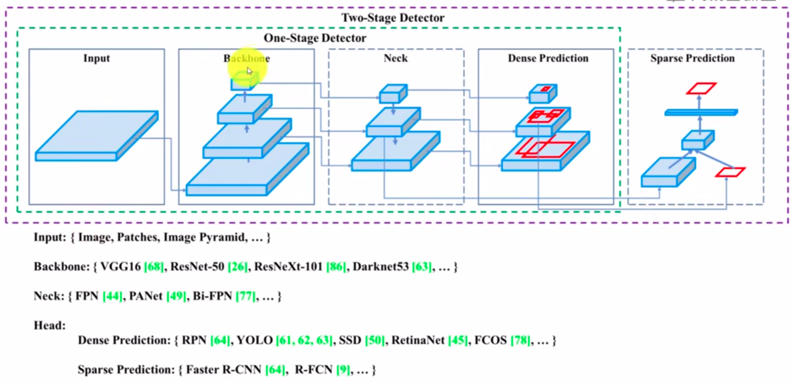

- Backbone: CSPDarknet53
- Neck: SPP, PAN
- Head:YOLO v3

The backbone, neck and head are chosen as the architecture of YOLOv4. 

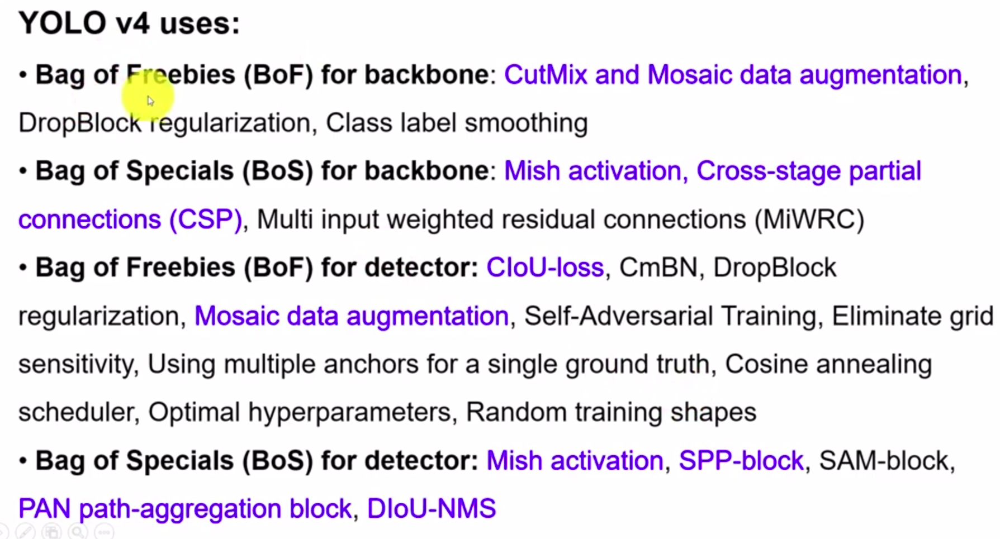


## The traffic sign detection based on YOLOv4

1. TT100K dataset format

Download the dataset: https://cg.cs.tsinghua.edu.cn/traffic-sign/

- TT100K dataset: data.zip, code.zip
- mypython.tar.gz
- Jinja2-2.10.1-py2.py3-none-any.whl

The label file is in the `annotations.json`. 


## PASCAL VOC annotation format and YOLO annotation formation

PASCAL VOC format uses the `xml` to record the coordinate. It contains the left corner of one image and the right corner coordinate.  The format is below:

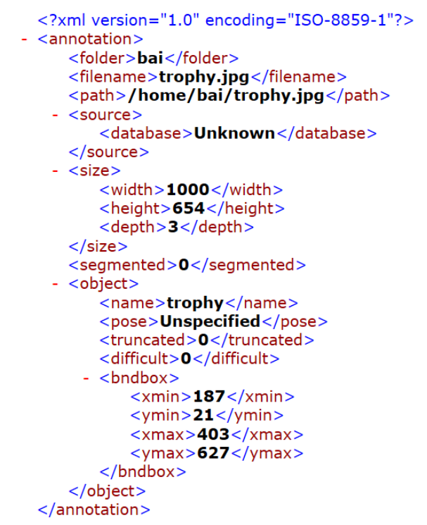


The `YOLO` format uses `txt` to store.  

It contains `class_id`, `x`, `y`, `w` and `h`.  The `x` and `y` means the image's centre coordination and `w` and `h` represent the image's width and height. 

The transfer between `PASCAL VOC` and `YOLO` format uses the function `convert(size, box)`:

```python
def convert(size, box):
    dw = 1. / size[0]
    dh = 1. / size[1]
    x = (box[0] + box[1]) / 2.0
    y = (box[2] + box[3]) / 2.0
    w = box[1] - box[0]
    h = box[3] - box[2]
    x = x * dw
    w = w * dw
    y = y * dh
    h = h * dh
    return (x, y , w, h)
```


## TT100K data transfer from annotation to YOLO annotation format

1. install jinjia2

```shell
sudo pip install Jinja2-2.10.1-py2.py3-none-any.whl

sudo pip install pillow
```


2. Use the `tt100k_to_voc_test.py` and `tt100k_to_voc_train.py` to transfer the `TT100K` dataset to `PASCAL VOC` `xml` format. 

```shell
python ./tt100k_to_voc_test.py

python ./tt100K_to_voc_train.py
```


3. Copy the `VOCdevkit` to `darknet` repository
4. Copy the images to `darknet`

```shell
cp ~/Downloads/TT100K/data/test/*.jpg  VOCdevkit/VOC2007/JPEGImages/

cp ~/Downloads/TT100K/data/train/*.jpg  VOCdevkit/VOC2007/JPEGImages/
```


## Prepare training and test dataset

Prepare these files:

- testfiles.tar.gz
- genfiles.py
- reval_voc.py
- voc_eval.py
- draw_pr.py


The datatset tree:

```
.
├── 2007_test.txt
├── 2007_train.txt
└── VOCdevkit
    └── VOC2007
        ├── Annotations
        ├── ImageSets
        ├── JPEGImages
        └── labels
```


Generate the training dataset and testing dataset:

```python
python genfiles.py
```

The `labels` are below the `VOCdevkit/VOC2007` and also, it generates the `2007_train.txt` and `2007_test.txt`. 

For the model training, it needs `2007_train.txt`, `2007_test.txt` ,`labels` and all images in the dataset. 


## Revise the config file


